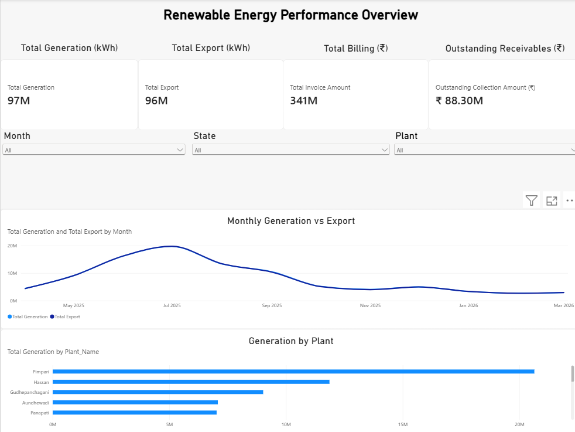
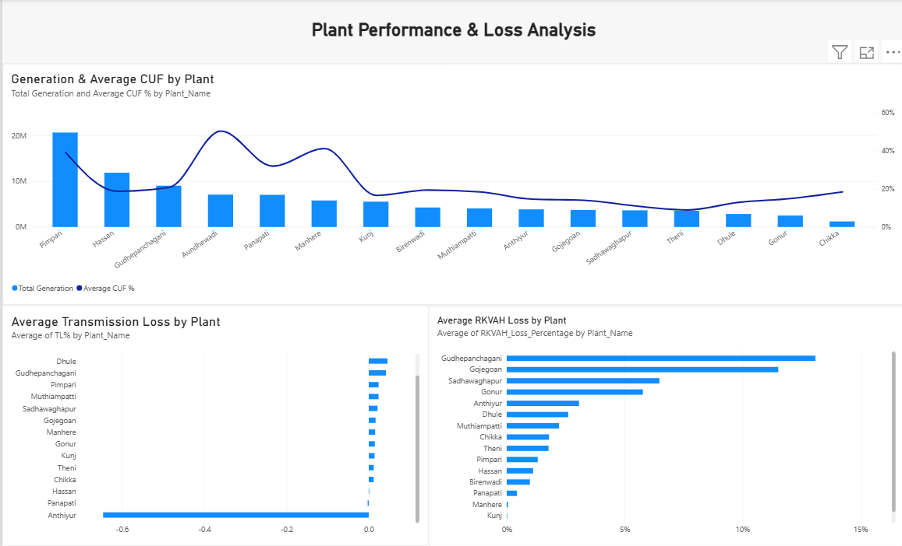
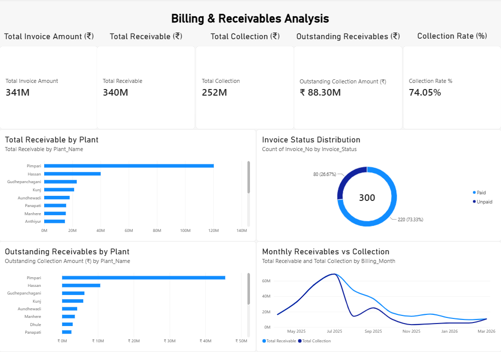

# Renewable Energy Performance Analysis

## Project Overview

This project analyzes renewable energy generation, energy export, plant performance, billing, receivables, collections, transmission losses, and RKVAH losses using **PostgreSQL, SQL, and Power BI**.

The objective of the project is to transform operational and financial data into actionable insights that can help monitor plant performance, identify performance variations, track billing and receivables, and highlight areas requiring further investigation.

The project combines **SQL-based analysis** with an interactive **Power BI dashboard** to provide both detailed analytical queries and management-level visual reporting.

---

## Business Objectives

The project focuses on the following business objectives:

- Analyze monthly and plant-wise energy generation
- Compare energy generated with energy exported
- Measure export efficiency
- Analyze plant-level generation performance
- Analyze billing and invoice performance
- Track receivables and collections
- Identify outstanding receivables
- Analyze plant-wise financial performance
- Analyze transmission losses
- Analyze RKVAH losses
- Compare plant performance using operational KPIs
- Identify areas requiring further investigation
- Build an interactive Power BI dashboard for management-level analysis

---

## Tools & Technologies

### Database & SQL
- PostgreSQL
- SQL
- pgAdmin

### Business Intelligence
- Microsoft Power BI
- DAX
- Power Query
- Data Modelling

### Analysis Techniques
- Data validation
- Aggregations
- GROUP BY and HAVING
- JOINs
- CASE statements
- Subqueries
- CTEs
- Window functions
- DENSE_RANK
- NULL handling
- Percentage calculations
- KPI development
- Interactive filtering

---

## Dataset & Data Model

The project uses multiple tables representing different areas of renewable energy operations and financial performance.

### Main Tables

| Table | Purpose |
|---|---|
| `Monthly_Generation` | Monthly plant-level generation, export and import data |
| `Billing` | Invoice, billing, tariff and receivable information |
| `Receivable` | Receivable, collection, payment and outstanding information |
| `Plant_Master` | Plant and location master information |
| `TL` / `Transmission_Loss` | Transmission loss information |
| `RKVAH` | RKVAH loss information |
| `Monthly_MIS` | Monthly management information |
| `Date_Table` | Date dimension used for Power BI analysis |

The Power BI data model connects operational, financial and master data to enable interactive plant-level and time-based analysis.

---

# Analysis Approach

The analysis was performed in two major stages.

## 1. SQL Analysis using PostgreSQL

PostgreSQL was used to perform detailed data analysis and business-level calculations.

The SQL analysis included:

### Data Validation
- Record-count validation
- Duplicate plant-month checks
- NULL-value checks
- Data consistency checks

### Energy Generation Analysis
- Total generation by plant
- Monthly generation
- Financial-year generation
- Highest and lowest performing plants
- Top and bottom plants by generation
- Generation contribution by plant
- Generation ranking
- Generation vs export analysis

### Export Analysis
- Total energy exported
- Monthly export
- Plant-wise export
- Export efficiency
- Average export efficiency
- Highest and lowest exporting plants

### Billing Analysis
- Total billing
- Plant-wise billing
- Export units billed
- Average tariff
- Highest and lowest invoices
- Financial-year billing analysis
- TDS analysis
- Receivable analysis

### Receivables Analysis
- Total receivables
- Receivable percentage
- Outstanding amounts
- Outstanding amount by plant
- Highest outstanding plant
- Monthly receivables
- Plant-wise receivable percentage
- Billing and generation comparison

### Loss Analysis
- Average transmission loss percentage
- Transmission loss by plant
- Monthly transmission loss
- Total transmission loss units
- Highest and lowest loss periods
- Financial-year loss analysis

The SQL analysis contains **60 project-level analytical questions and queries** covering operational and financial performance.

---

# 2. Power BI Analysis

Power BI was used to convert the analytical results into an interactive dashboard.

The Power BI workflow included:

### Data Preparation
- Imported operational and financial tables
- Removed unnecessary fields
- Validated data types
- Created required keys
- Prepared date-related fields
- Established relationships between tables

### Data Modelling

The model uses relationships between:

- Plant Master
- Monthly Generation
- Billing
- Receivable
- Transmission Loss
- RKVAH
- Monthly MIS
- Date Table

### DAX Measures

Measures were created for important KPIs such as:

- Total Generation
- Total Export
- Total Billing
- Total Receivable
- Total Collection
- Outstanding Receivables
- Collection Rate
- Average CUF
- Average Transmission Loss
- Average RKVAH Loss

### Interactive Analysis

The dashboard includes interactive filters for:

- Month
- State
- Plant

These filters allow users to analyze the KPIs and visuals at different levels of detail.

---

# Key KPIs

The Power BI dashboard provides a consolidated view of the major operational and financial KPIs.

| KPI | Dashboard Value |
|---|---:|
| Total Generation | ~97M kWh |
| Total Export | ~96M kWh |
| Total Billing | ~₹341M |
| Total Receivable | ~₹340M |
| Total Collection | ~₹252M |
| Outstanding Receivables | ~₹88.30M |
| Collection Rate | 74.05% |
| Plants Analyzed | 25 |
| Billing Records | 300 |

> KPI values shown above are based on the current Power BI dashboard and may change when dashboard filters are applied.

---

# Key Findings

## Energy Generation & Export

- Total energy generation is approximately **97M kWh**.
- Total energy export is approximately **96M kWh**.
- Generation and export were analyzed at both monthly and plant levels.
- The monthly trend shows significant variation in generation across the analysis period.
- Plant-level generation varies considerably, allowing high- and low-performing plants to be identified.
- Generation contribution was calculated to understand the share of individual plants in overall generation.

---

## Plant Performance

Plant performance was analyzed using:

- Total generation
- Average monthly generation
- Average CUF
- Export performance
- Transmission losses
- RKVAH losses

The Power BI dashboard provides a comparison of generation and average CUF across plants.

This helps identify plants that contribute significantly to total generation and plants requiring further operational investigation.

---

## Billing Performance

The billing analysis provides visibility into:

- Total invoice amount
- Plant-wise billing
- Monthly billing
- Export units billed
- Average tariff
- Invoice-level performance
- Financial-year billing

The overall billing value shown in the dashboard is approximately **₹341M**.

---

## Receivables & Collections

The receivables dashboard provides visibility into:

- Total receivables
- Total collections
- Outstanding receivables
- Collection rate
- Plant-wise receivables
- Plant-wise outstanding amounts
- Monthly receivables and collections
- Invoice status distribution

The current dashboard shows:

- **Total Receivable:** ~₹340M
- **Total Collection:** ~₹252M
- **Outstanding Receivables:** ~₹88.30M
- **Collection Rate:** 74.05%

Plant-level analysis helps identify where receivables and outstanding amounts are concentrated.

---

## Transmission Loss Analysis

Transmission losses were analyzed using:

- Average transmission loss percentage by plant
- Monthly average transmission loss
- Total transmission loss units
- Highest and lowest loss periods
- Financial-year loss analysis

The dashboard provides a plant-level comparison of average transmission losses.

Some loss values in the underlying data are negative, so these values have been treated as **data points requiring further investigation** rather than automatically interpreted as operational performance.

---

## RKVAH Loss Analysis

RKVAH losses were analyzed at the plant level and visualized in Power BI.

The dashboard provides a comparison of average RKVAH loss percentage across plants, allowing differences in plant-level performance to be identified.

---

# Power BI Dashboard

The Power BI report contains three analytical pages.

## Page 1 — Energy Performance Overview

This page provides a consolidated overview of:

- Total Generation
- Total Export
- Total Billing
- Outstanding Receivables
- Monthly Generation vs Export
- Generation by Plant
- Month filter
- State filter
- Plant filter

The page provides a high-level view of operational and financial performance.

---

## Page 2 — Plant Performance & Loss Analysis

This page focuses on operational performance and losses.

It includes:

- Generation by Plant
- Average CUF by Plant
- Average Transmission Loss by Plant
- Average RKVAH Loss by Plant

This page allows plant-level operational performance to be compared across multiple KPIs.

---

## Page 3 — Billing & Receivables Analysis

This page focuses on financial performance.

It includes:

- Total Invoice Amount
- Total Receivable
- Total Collection
- Outstanding Receivables
- Collection Rate
- Total Receivable by Plant
- Outstanding Receivables by Plant
- Invoice Status Distribution
- Monthly Receivables vs Collection

This page provides a consolidated view of billing and collection performance.

---

# Dashboard Screenshots

## Renewable Energy Performance Overview



## Plant Performance & Loss Analysis



## Billing & Receivables Analysis



---

# Key Analytical Observations

The analysis highlights several areas that can be investigated further:

### 1. Generation varies significantly across plants

Plant-level generation shows substantial variation, indicating different levels of contribution to overall energy generation.

### 2. Generation and export closely track each other

The dashboard shows a close relationship between total generation and total export across the analyzed period.

### 3. Receivables require monitoring

The dashboard shows approximately **₹88.30M in outstanding receivables**, making receivable monitoring an important financial-performance area.

### 4. Collection performance can be monitored at plant level

The **74.05% collection rate** provides a high-level view of collection performance, while plant-wise visuals help identify concentration of outstanding amounts.

### 5. Loss analysis highlights areas for investigation

Transmission and RKVAH loss comparisons reveal differences between plants and provide a basis for further operational investigation.

### 6. Data-quality checks are important

During SQL analysis, certain data-quality observations were identified, including negative loss values and export-efficiency calculations exceeding 100% for some plant-level records.

These observations were treated as **data-quality or source-definition points requiring investigation**, rather than being directly interpreted as physical operating efficiency.

---

# SQL Analysis Highlights

The SQL analysis demonstrates practical use of PostgreSQL for business analytics.

Key SQL concepts used include:

```text
SELECT
WHERE
GROUP BY
HAVING
ORDER BY
LIMIT
JOIN
CASE WHEN
NULLIF
Subqueries
CTEs
Window Functions
DENSE_RANK
Aggregate Functions
Percentage Calculations
